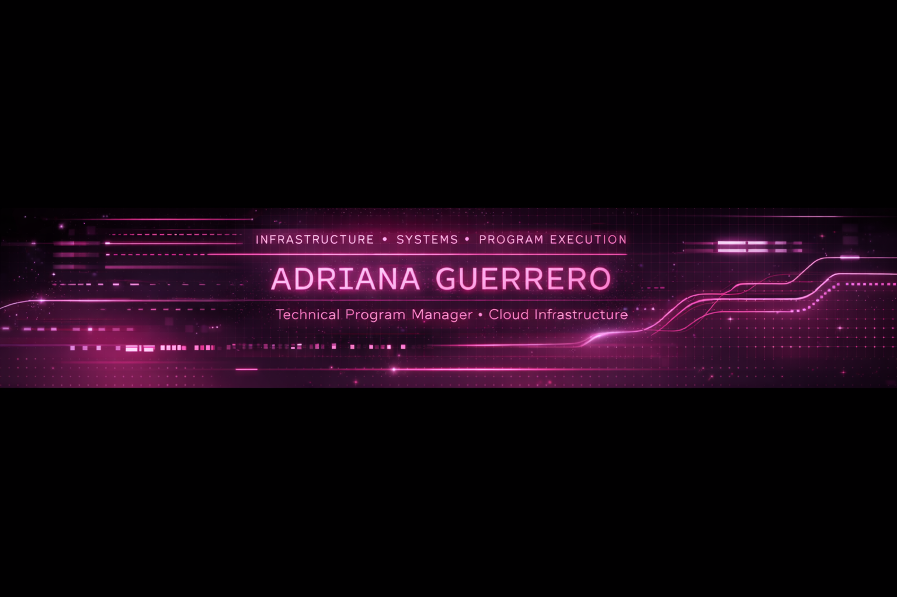

## Hi, I’m Adriana Guerrero

Infrastructure & Technical Program Management  
Cloud · Systems · Security-minded  
MS-MIS @ Texas A&M University  

I work at the intersection of cloud infrastructure, systems thinking, and program execution — helping technical teams deliver reliable, well-structured solutions with clarity and intention.

---

## ✨ What I’m Building

Cloud & infrastructure projects (AWS, networking, databases)  
Program & process optimization for technical teams  
Security-minded systems and risk awareness  

---

## ✨ Technical Focus

**Cloud & Infrastructure**  
AWS (EC2, VPC, IAM), LAMP stack  

**Systems & Data**  
Linux, MariaDB, SQL  

**Program & Tools**  
GitHub, Smartsheet, Microsoft 365  

**Security**  
Cybersecurity fundamentals, risk & policy awareness  

---

## 🎯 2026 Goals

Deepen cloud and infrastructure expertise  
Ship end-to-end technical projects  
Contribute to security-focused repositories  

---

## 💫 Activity Snapshot

---

## 💌 Connect with Me

LinkedIn: https://www.linkedin.com/in/adrianatamu/
